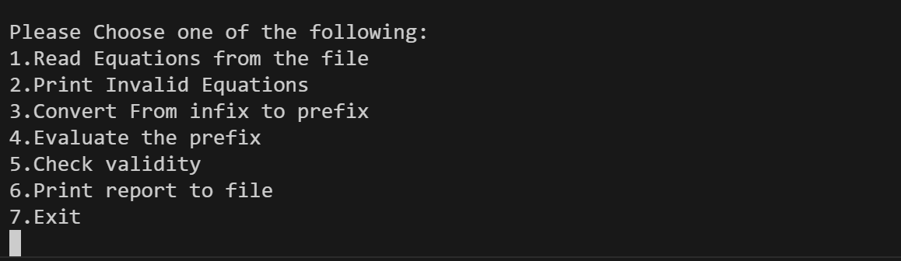

# Stack-Based Prefix Expression Calculator  

The **Stack-Based Prefix Expression Calculator** is a C-based data structure project that utilizes the **stack data structure** to process mathematical expressions efficiently.This system reads equations from a file, checks their validity, converts infix expressions to prefix notation, evaluates prefix expressions, and generates a report.  

The implementation of **stacks** ensures an optimal approach to handling mathematical operations, as stacks are well-suited for expression evaluation and conversion. 

## Features  

- `Read Equations from the File` – Reads mathematical equations from an input file.  
- `Print Invalid Equations` – Identifies and displays invalid equations.  
- `Convert from Infix to Prefix` – Transforms infix notation equations into prefix notation using stack operations.  
- `Evaluate the Prefix` – Computes the result of the prefix expression.  
- `Check Validity` – Ensures the given equation is properly formatted.  
- `Print Report to File` – Saves the processed results, including valid and invalid equations, to a report file.  

## File Descriptions

- `Program.c`: Main C program 
- `eq.txt`: Input file containing the mathematical expressions 

## Example Usage

To run the program, provide the input file "eqs.txt" containingthe mathematical expressions and Run the Program.c file :

## Contact

For any inquiries, reach out via:

- Email: [miar.taweel04@gmail.com](mailto\:miar.taweel04@gmail.com)
- GitHub: [miarTaweel](https://github.com/miarTaweel)
